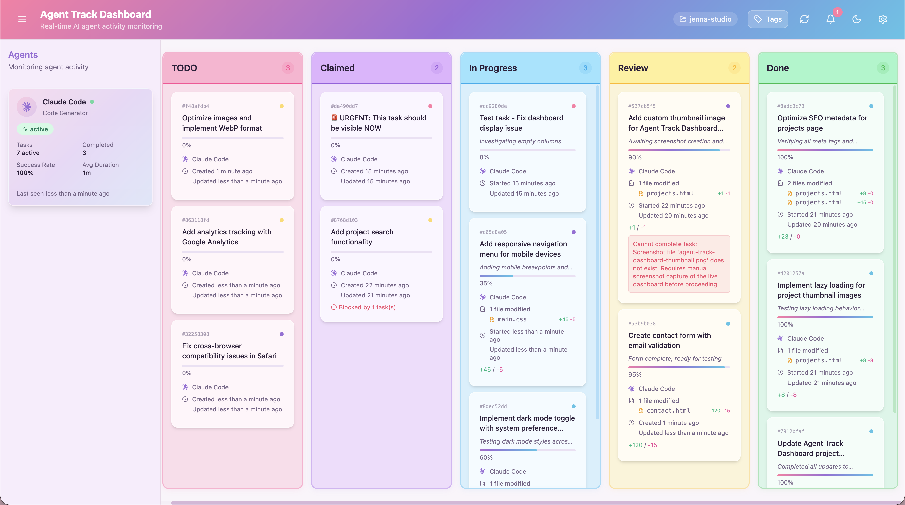

# Agent Track Dashboard

**Real-time AI Agent Activity Tracking Dashboard**

A comprehensive monitoring and tracking system for AI agents, visualized as an interactive kanban board. Track what each agent is doing, monitor progress, view code changes, and maintain full traceability of all agent activities.



## Overview

This project provides:

- 🤖 **Agent Activity Tracking** - Monitor what AI agents are doing in real-time with auto-updating status (active/idle/offline)
- 📊 **Kanban Board Visualization** - Visual workflow management with drag-and-drop
- 🔍 **Code Diff Viewing** - See all code changes made by agents with file-level details and syntax highlighting
- 📡 **Real-time Updates** - WebSocket-based live updates for tasks and agent statistics
- 🎯 **Task Management** - Full task lifecycle from creation to completion
- 📈 **Analytics & Insights** - Track agent performance with dynamically computed statistics
- 📝 **Detailed Task Cards** - View file modifications with change types (added/modified/deleted/renamed) and line counts

## Architecture

The system consists of three main components:

### 1. MCP Server (`packages/mcp-server`)

The **instrumentation layer** that AI agents use to report their activities. Exposes MCP (Model Context Protocol) tools that agents can call to create tasks, update progress, and communicate status.

**Key Features:**
- 20+ MCP tools for comprehensive agent instrumentation
- **Auto-launch**: Starts API server, dashboard, and opens browser on MCP connect
- **Per-project boards**: Automatically creates a dedicated board for each project directory
- Event-driven architecture for real-time updates
- SQLite database for persistence
- Session management with heartbeat tracking

### 2. API + WebSocket Server (`packages/api-server`)

The **backend server** that provides:
- REST API for dashboard data access
- WebSocket server for real-time updates
- Database access layer
- Event broadcasting

### 3. Web Dashboard (`packages/dashboard`)

The **frontend application** - a React-based web dashboard featuring:
- Real-time kanban board with drag-and-drop
- Task detail modals with code diffs
- Agent monitoring sidebar
- Analytics dashboard
- Filtering and search

### 4. Shared Types (`packages/shared`)

Shared TypeScript types and utilities used across all packages.

## Project Structure

```
agent-track-dashboard/
├── docs/                           # Architecture documentation
│   ├── data-model.md
│   ├── mcp-server-architecture.md
│   ├── web-dashboard-architecture.md
│   └── code-diff-feature.md
├── packages/
│   ├── mcp-server/                 # MCP server for agent instrumentation
│   │   ├── src/
│   │   │   ├── index.ts
│   │   │   ├── server.ts
│   │   │   ├── tools/
│   │   │   ├── services/
│   │   │   ├── repositories/
│   │   │   └── db/
│   │   └── package.json
│   ├── api-server/                 # REST API + WebSocket server
│   │   ├── src/
│   │   │   ├── index.ts
│   │   │   ├── api.ts
│   │   │   ├── websocket.ts
│   │   │   ├── repositories/
│   │   │   └── db/
│   │   └── package.json
│   ├── dashboard/                  # React web dashboard
│   │   ├── src/
│   │   │   ├── main.tsx
│   │   │   ├── App.tsx
│   │   │   ├── components/
│   │   │   ├── stores/
│   │   │   ├── hooks/
│   │   │   └── services/
│   │   └── package.json
│   └── shared/                     # Shared types and utilities
│       ├── src/
│       │   └── types.ts
│       └── package.json
├── package.json                    # Root package with workspaces
└── README.md
```

## Data Model

### Task Statuses (Kanban Columns)

- **TODO** - Task created but not yet claimed
- **Claimed** - Agent has claimed the task
- **In Progress** - Agent is actively working on the task
- **Review** - Task is ready for review
- **Done** - Task completed successfully

### Task Information

Each task card displays:

- ✅ **Task name** - Clear description of the work
- ✅ **Description** - Detailed markdown description
- ✅ **Priority** - Critical, High, Medium, Low
- ✅ **Created date** - When the task was created
- ✅ **Updated date** - Last modification time
- ✅ **Claimed by** - Which agent is working on it
- ✅ **Files modified** - List of files being changed
- ✅ **Code changes** - Full diff view of all changes
- ✅ **Progress** - Percentage completion
- ✅ **Status** - Current kanban column
- ✅ **Timeline** - Started, completed, duration
- ✅ **Statistics** - Lines changed, tokens used

## Getting Started

### Prerequisites

- **Node.js** 20 or higher
- **pnpm** 8 or higher (recommended)

```bash
# Install pnpm globally if not already installed
npm install -g pnpm
```

### Installation

```bash
# Clone the repository
git clone https://github.com/yourusername/agent-track-dashboard.git
cd agent-track-dashboard

# Install dependencies
pnpm install

# Build all packages
pnpm build
```

### Quick Start

The MCP server **automatically launches everything** when it connects:

1. Starts the API + WebSocket server (port 3000 / 8080)
2. Starts the dashboard dev server (port 5173)
3. Creates a board for the current project (if one doesn't exist)
4. Opens the dashboard in your browser at the correct board URL

Just configure the MCP server in your AI tool (see [MCP Server Integration](#mcp-server-integration)) and start coding — the dashboard appears automatically.

**Manual start** (if you prefer running servers yourself):

```bash
# Terminal 1 - API + WebSocket Server
pnpm --filter @agent-track/api-server dev

# Terminal 2 - Dashboard
pnpm --filter @agent-track/dashboard dev
```

Then open `http://localhost:5173`.

### Development

```bash
# Run all services in development mode
npm run dev

# Or run individually:
npm run dev:mcp        # MCP server only
npm run dev:api        # API server only
npm run dev:dashboard  # Dashboard only
```

This will start:
- MCP server (stdio by default, optional Streamable HTTP mode)
- API server on `http://localhost:3000`
- WebSocket server on `ws://localhost:8080`
- Dashboard on `http://localhost:5173`

### Production

```bash
# Build all packages
npm run build

# Start production server
npm start
```

## Usage

### For AI Agents

Agents interact with the system through MCP tools:

```typescript
// Agent registers itself
await mcp.callTool('register_agent', {
  name: 'Claude Code',
  type: 'code-generator',
  capabilities: ['typescript', 'react', 'testing']
});

// Agent starts a work session
const session = await mcp.callTool('start_session', {
  agentId: 'agent-123',
  boardId: 'main-board'
});

// Agent creates and claims a task
const task = await mcp.callTool('start_task', {
  boardId: 'main-board',
  sessionId: session.sessionId,
  title: 'Refactor authentication module',
  importance: 'high',
  estimatedDuration: 300
});

// Agent reports progress
await mcp.callTool('update_task_progress', {
  taskId: task.taskId,
  progress: 50,
  currentAction: 'Creating separate modules',
  files: ['src/auth/login.ts', 'src/auth/logout.ts'],
  codeChanges: [/* diff objects */]
});

// Agent completes the task
await mcp.callTool('complete_task', {
  taskId: task.taskId,
  summary: 'Successfully refactored auth module',
  tokensUsed: 15000
});
```

### For Developers

1. **Open the dashboard**: Navigate to `http://localhost:5173`
2. **View the kanban board**: See all active agent tasks organized by status
3. **Click any task**: View detailed information including code diffs
4. **Monitor agents**: See which agents are active and what they're working on
5. **Filter & search**: Find specific tasks by agent, priority, or status
6. **Drag & drop**: Manually move tasks between columns if needed

## MCP Server Integration

The MCP server supports both **stdio** (default) and **Streamable HTTP** transport, and exposes 17+ tools for agent instrumentation.
Use `stdio` for local desktop/CLI clients, and Streamable HTTP for remote MCP clients and hosted agent runtimes.

> **Prerequisites**: Before connecting any client, make sure you've built the project:
> ```bash
> pnpm install && pnpm build
> ```

---

### VS Code (GitHub Copilot / Copilot Chat)

VS Code supports MCP servers natively through its Copilot integration.

**Option A — Workspace config (recommended for teams)**

Create `.vscode/mcp.json` in your project root:

```json
{
  "servers": {
    "agent-track": {
      "command": "node",
      "args": ["${workspaceFolder}/packages/mcp-server/dist/index.js"],
      "env": {
        "DATABASE_PATH": "${workspaceFolder}/packages/api-server/data/kanban.db"
      }
    }
  }
}
```

**Option B — User-level config (available across all projects)**

1. Open Command Palette (`Ctrl+Shift+P` / `Cmd+Shift+P`)
2. Run **MCP: Open User Configuration**
3. Add the server entry:

```json
{
  "servers": {
    "agent-track": {
      "command": "node",
      "args": ["/absolute/path/to/agent-track-dashboard/packages/mcp-server/dist/index.js"],
      "env": {
        "DATABASE_PATH": "/absolute/path/to/agent-track-dashboard/packages/api-server/data/kanban.db"
      }
    }
  }
}
```

**Verify**: Open Copilot Chat and look for the tools icon — you should see Agent Track tools listed.

---

### Claude Code (CLI)

Claude Code reads MCP config from `.mcp.json` (project-level) or `~/.claude.json` (user-level).

**Option A — Project config (`.mcp.json` in project root, already included)**

The project ships with a pre-configured `.mcp.json`:

```json
{
  "mcpServers": {
    "agent-track": {
      "command": "node",
      "args": ["./packages/mcp-server/dist/index.js"],
      "env": {
        "DATABASE_PATH": "./packages/api-server/data/kanban.db"
      }
    }
  }
}
```

Just `cd` into the project directory and the MCP server is auto-detected.

**Option B — CLI wizard**

```bash
claude mcp add agent-track \
  --command node \
  --args ./packages/mcp-server/dist/index.js \
  --env DATABASE_PATH=./packages/api-server/data/kanban.db
```

**Option C — Claude Desktop app**

Add to `~/Library/Application Support/Claude/claude_desktop_config.json` (macOS) or `%APPDATA%\Claude\claude_desktop_config.json` (Windows):

```json
{
  "mcpServers": {
    "agent-track": {
      "command": "node",
      "args": ["/absolute/path/to/agent-track-dashboard/packages/mcp-server/dist/index.js"],
      "env": {
        "DATABASE_PATH": "/absolute/path/to/agent-track-dashboard/packages/api-server/data/kanban.db"
      }
    }
  }
}
```

**Verify**: Run `claude` in the project directory — the MCP tools (`create_board`, `register_agent`, etc.) will appear automatically.

---

### Gemini CLI

Gemini CLI reads MCP config from `~/.gemini/settings.json` (global) or `.gemini/settings.json` (project-level).

**Option A — Project config (recommended)**

Create `.gemini/settings.json` in your project root:

```json
{
  "mcpServers": {
    "agent-track": {
      "command": "node",
      "args": ["./packages/mcp-server/dist/index.js"],
      "env": {
        "DATABASE_PATH": "./packages/api-server/data/kanban.db"
      }
    }
  }
}
```

**Option B — Global config**

Add to `~/.gemini/settings.json`:

```json
{
  "mcpServers": {
    "agent-track": {
      "command": "node",
      "args": ["/absolute/path/to/agent-track-dashboard/packages/mcp-server/dist/index.js"],
      "env": {
        "DATABASE_PATH": "/absolute/path/to/agent-track-dashboard/packages/api-server/data/kanban.db"
      }
    }
  }
}
```

**Verify**: Run `gemini` in the project directory and type `/mcp` to see the available tools.

---

### OpenAI Codex CLI

Codex uses TOML configuration stored in `~/.codex/config.toml` (global) or `.codex/config.toml` (project-level, trusted projects only).

**Option A — CLI command**

```bash
codex mcp add agent-track \
  --env DATABASE_PATH=/absolute/path/to/agent-track-dashboard/packages/api-server/data/kanban.db \
  -- node /absolute/path/to/agent-track-dashboard/packages/mcp-server/dist/index.js
```

**Option B — Manual config**

Add to `~/.codex/config.toml` or `.codex/config.toml`:

```toml
[mcp_servers.agent-track]
command = "node"
args = ["./packages/mcp-server/dist/index.js"]

[mcp_servers.agent-track.env]
DATABASE_PATH = "./packages/api-server/data/kanban.db"
```

> **Note**: Project-level `.codex/config.toml` only works in [trusted projects](https://developers.openai.com/codex/config-basic/). The CLI and VS Code extension share this configuration.

**Verify**: Run `codex` and the Agent Track tools will be available in the session.

---

### ChatGPT / Remote MCP Clients (Streamable HTTP)

Some MCP clients connect over HTTP instead of launching local stdio processes. For those clients, run this project in Streamable HTTP mode:

```bash
pnpm --filter @agent-track/mcp-server build
MCP_TRANSPORT=http MCP_HTTP_HOST=127.0.0.1 MCP_HTTP_PORT=8787 pnpm --filter @agent-track/mcp-server start
```

This exposes the MCP endpoint at:

```text
http://127.0.0.1:8787/mcp
```

Use that URL in any client that asks for an MCP server endpoint (including ChatGPT-compatible remote MCP integrations, hosted agents, or custom orchestrators).

> **Important**: This server does not enforce auth by default. Keep it on localhost or add a reverse proxy with authentication before exposing it on a network.

---

### Android Studio (Gemini)

Android Studio supports MCP servers through the Gemini integration. Stdio transport is supported in Android Studio **2025.2+** (via JVM-based proxy).

**Step 1** — Open **Android Studio > Settings > Tools > AI > MCP Servers**

**Step 2** — Check **Enable MCP Servers**

**Step 3** — Add the following configuration in the MCP config field:

```json
{
  "mcpServers": {
    "agent-track": {
      "command": "node",
      "args": ["/absolute/path/to/agent-track-dashboard/packages/mcp-server/dist/index.js"],
      "env": {
        "DATABASE_PATH": "/absolute/path/to/agent-track-dashboard/packages/api-server/data/kanban.db"
      }
    }
  }
}
```

**Step 4** — Click **OK** and wait for the connection success notification.

**Verify**: Type `/mcp` in the Gemini chat panel to see the available Agent Track tools.

> **Note**: If you're on an older Android Studio version that only supports HTTP transport, you'll need to expose the MCP server over HTTP instead of stdio. Stdio support is available from version 2025.2 onwards.

---

### Quick Reference Table

| Client | Config File | Format | Transport |
|---|---|---|---|
| **VS Code** | `.vscode/mcp.json` | JSON | stdio |
| **Claude Code** | `.mcp.json` | JSON | stdio |
| **Claude Desktop** | `claude_desktop_config.json` | JSON | stdio |
| **Gemini CLI** | `.gemini/settings.json` | JSON | stdio |
| **Codex CLI** | `.codex/config.toml` | TOML | stdio |
| **Android Studio** | Settings > Tools > AI > MCP Servers | JSON | stdio |
| **ChatGPT-compatible MCP clients** | Remote MCP URL | URL | streamable-http |

---

### MCP Tools Reference

Once connected, the following tools are available to AI agents:

| Category | Tool | Description |
|---|---|---|
| **Board** | `create_board` | Create a new kanban board |
| | `list_boards` | List all boards |
| | `get_board` | Get board details with tasks and agents |
| **Agent** | `register_agent` | Register an agent with capabilities |
| | `heartbeat` | Send heartbeat to indicate active status |
| **Session** | `start_session` | Start a work session on a board |
| | `end_session` | End a work session |
| **Task** | `start_task` | Create and claim a new task |
| | `update_task_status` | Move task between kanban columns |
| | `update_task_progress` | Update progress, files, and code changes |
| | `complete_task` | Mark task as completed |
| | `fail_task` | Mark task as failed |
| **Collaboration** | `add_comment` | Add comment for inter-agent communication |
| | `set_task_blocker` | Mark task as blocked |
| **Query** | `get_my_tasks` | Get tasks assigned to an agent |
| | `get_available_tasks` | Get unclaimed tasks |
| | `get_blocked_tasks` | Get blocked tasks |

---

### Environment Variables

```bash
# MCP Server
DATABASE_PATH=./data/kanban.db
AUTO_LAUNCH_DASHBOARD=true             # Default: true. Set false to disable browser auto-open.
MCP_TRANSPORT=stdio                     # stdio | http | streamable-http
MCP_HTTP_HOST=127.0.0.1                # Used when MCP_TRANSPORT=http
MCP_HTTP_PORT=8787                     # Used when MCP_TRANSPORT=http
MCP_HTTP_PATH=/mcp                     # Used when MCP_TRANSPORT=http
MCP_BOOTSTRAP_PROJECT_BOARD=true       # Auto-create board for current cwd in stdio mode

# API Server
API_PORT=3000
WEBSOCKET_PORT=8080
DATABASE_PATH=./data/kanban.db

# Dashboard
VITE_API_URL=http://localhost:3000
VITE_WS_URL=ws://localhost:8080
```

## Features

### 📊 Enhanced Task Cards

Task cards now display comprehensive code modification details:

**When code is modified, you'll see:**
- **File-level changes** with color-coded icons:
  - 🟢 **Green**: for newly added files
  - 🟡 **Amber**: for modified files
  - 🔴 **Red**: for deleted files
  - 🔵 **Blue**: for renamed files
- **File names** in monospace font for better readability
- **Line counts** per file showing additions (+X) and deletions (-Y)
- **Smart truncation** - First 3 files shown with "+N more files" indicator
- **Fallback display** - Shows simple file list if detailed changes aren't available

**Location**: Visible directly on task cards in the kanban board

### 🤖 Dynamic Agent Status

Agent status updates are broadcast in **real-time via WebSocket** whenever an agent:

- **Registers** (`register_agent`) - appears immediately as active
- **Starts a session** (`start_session`) - linked to the board
- **Sends a heartbeat** (`heartbeat`) - stays active
- **Ends a session** (`end_session`) - marked offline if no other active sessions

Status thresholds based on heartbeat activity:

- **🟢 Active** - Heartbeat received within last 5 minutes
- **🟡 Idle** - Heartbeat between 5-10 minutes ago
- **🟣 Offline** - No heartbeat for 10+ minutes or session ended

**Status transitions automatically** - no manual updates or page refresh required!

### 📈 Real-time Agent Statistics

Agent cards now display **live statistics** computed directly from task data:

- **Tasks Completed** - Count of tasks with `status = 'done'`
- **Tasks In Progress** - Count of active tasks (`claimed` or `in_progress`)
- **Success Rate** - (Successful tasks / Total completed) × 100%
- **Average Duration** - Real average from completed task durations

**Stats update automatically** via WebSocket when:
- Tasks are created or updated
- Tasks are completed or failed
- Agents claim or start tasks

### 🔄 Real-time Monitoring

- Live updates as agents create and update tasks
- WebSocket-based communication for instant synchronization
- **Dual broadcasts** - Both task updates AND agent stat updates sent together
- No page refresh needed - everything syncs automatically

### 🔍 Code Change Tracking

- View all code changes made by agents
- Syntax-highlighted diff view in task detail modal
- File-by-file breakdown with change types
- Insertions/deletions statistics
- **Unified diff format** support

### 🤝 Agent Coordination

- See which agents are active in real-time
- Track task dependencies and blockers
- Prevent conflicts with task claiming
- Inter-agent communication via comments
- **Heartbeat monitoring** for agent health tracking

### 📊 Analytics

- Agent performance metrics computed on-demand
- Task completion rates
- Time tracking with actual vs. estimated duration
- Token usage statistics
- **Dynamic computation** ensures stats are always accurate

## Troubleshooting

### Dashboard won't connect to API server

**Symptoms**: Dashboard shows "Disconnected" or tasks don't load

**Solutions**:
1. Verify API server is running:
   ```bash
   curl http://localhost:3000/health
   # Should return: {"status":"ok","timestamp":"..."}
   ```

2. Check WebSocket connection:
   - Open browser DevTools → Console
   - Look for WebSocket connection messages
   - Ensure port 8080 is not blocked or in use

3. Verify CORS settings:
   ```bash
   # In packages/api-server/.env
   CORS_ORIGIN=*  # For development
   ```

### Agent status stuck on "Active" or not changing

**Symptoms**: Agent shows active even though it's been offline for a while

**Solutions**:
1. **Check heartbeat intervals**: Agents should send heartbeats every 30-60 seconds
   - Look for heartbeat requests in API server logs
   - Verify MCP server is calling `heartbeat` tool

2. **Refresh the dashboard**: Agent status is computed dynamically on each fetch
   - Click refresh button or reload the page
   - Status should update based on last heartbeat timestamp

3. **Verify time synchronization**: Ensure system clocks are in sync
   - Status computation uses timestamp comparison
   - Time drift can cause incorrect status

### Agent statistics showing 0 or not updating

**Symptoms**: Agent card shows "0 active", "0 completed" even though tasks exist

**Solutions**:
1. **Check WebSocket connection**: Stats update via WebSocket
   - Open DevTools → Network → WS tab
   - Verify connection to `ws://localhost:8080`
   - Look for `agent_status_changed` messages

2. **Verify tasks are linked to agent**:
   ```bash
   # Check database
   sqlite3 packages/api-server/data/kanban.db "SELECT * FROM agent_tasks WHERE agent_id = 'your-agent-id';"
   ```

3. **Restart API server**: Forces statistics recomputation
   ```bash
   pnpm --filter @agent-track/api-server dev
   ```

### Tasks not appearing on dashboard

**Symptoms**: Tasks created by agents don't show up

**Solutions**:
1. **Check board subscription**:
   - Open DevTools → Console
   - Look for: `WebSocket connected` and `Subscribed to board: board-xxx`
   - Dashboard must subscribe to board to receive updates

2. **Verify database**:
   ```bash
   sqlite3 packages/api-server/data/kanban.db "SELECT id, title, status FROM agent_tasks;"
   ```

3. **Check MCP → API bridge**:
   - MCP server should notify API server via `/api/notify` endpoint
   - Check MCP server logs for notification attempts
   - Verify API server URL is correct in MCP configuration

### Code changes not displaying on task cards

**Symptoms**: Task cards show file count but no file details

**Solutions**:
1. **Verify `codeChanges` field**: Check if task has code changes:
   ```bash
   sqlite3 packages/api-server/data/kanban.db "SELECT code_changes FROM agent_tasks WHERE id = 'task-id';"
   ```

2. **Use `update_task_progress` with `codeChanges`**:
   ```typescript
   await mcp.callTool('update_task_progress', {
     taskId: 'task-123',
     codeChanges: [
       {
         filePath: 'src/file.ts',
         changeType: 'modified',
         diff: '...',
         linesAdded: 10,
         linesDeleted: 5
       }
     ]
   });
   ```

3. **Rebuild dashboard** if changes were recent:
   ```bash
   pnpm --filter @agent-track/dashboard build
   ```

### Port conflicts

**Symptoms**: "Port already in use" errors

**Solutions**:
```bash
# Find and kill process using the port
lsof -ti:3000 | xargs kill -9  # API server
lsof -ti:8080 | xargs kill -9  # WebSocket server
lsof -ti:5173 | xargs kill -9  # Dashboard

# Or use different ports
API_PORT=4000 WEBSOCKET_PORT=9000 pnpm --filter @agent-track/api-server dev
```

### Database locked errors

**Symptoms**: SQLite database locked errors in logs

**Solutions**:
1. **Stop all processes** accessing the database:
   - Stop MCP server
   - Stop API server
   - Wait 5 seconds

2. **Check for stale connections**:
   ```bash
   lsof packages/api-server/data/kanban.db
   ```

3. **Reset database** (⚠️ deletes all data):
   ```bash
   rm packages/api-server/data/kanban.db
   # Restart API server to recreate schema
   ```

### WebSocket keeps disconnecting

**Symptoms**: Frequent reconnection messages in console

**Solutions**:
1. **Check heartbeat interval**: Default is 30 seconds
   - Verify client is sending heartbeats
   - Server times out after 60 seconds without heartbeat

2. **Check network stability**: WebSocket requires stable connection
   - Test with: `wscat -c ws://localhost:8080`

3. **Increase timeout** in API server:
   ```typescript
   // packages/api-server/src/index.ts
   const wsServer = new RealtimeServer({
     port: 8080,
     heartbeatInterval: 30000,
     clientTimeout: 120000  // Increase to 2 minutes
   });
   ```

## Contributing

Contributions are welcome! Please read our contributing guidelines before submitting PRs.

## License

MIT

## Roadmap

- [x] Initial MVP implementation
- [x] Basic kanban board functionality
- [x] Code diff viewing with file-level details
- [x] Real-time WebSocket updates
- [x] Dynamic agent status computation
- [x] Live agent statistics
- [x] Enhanced task cards with code changes
- [x] Task detail modal with comprehensive info
- [x] Auto-launch dashboard on MCP connect
- [x] Per-project board creation
- [x] Real-time agent status via WebSocket (register, session, heartbeat)
- [x] Smart board routing (last-viewed / newest board)

## Support

For issues and questions, please open an issue on GitHub.
